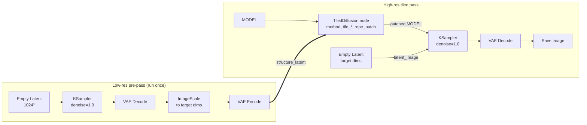

# Technical Notes

Technical documentation for this fork's DiT-era tiling work: what breaks when UNet-style tiling meets Diffusion Transformers, and what this fork does about it. Moved here from the README to keep that readable; nothing in this file is required for everyday use.

Receipts and test artifacts referenced throughout live in `tests/` (regression tests, measurement probes, the A/B/C render-matrix driver) and `tests/checklists/` (human test checklists with empirical run notes).

## DiT/Flux Enhancements

UNet-era tiled diffusion treats the model as a black box and only splits latents spatially. That breaks for Diffusion Transformers (Flux, Flux.2, SD3, Qwen-Image-Edit) because:

1. **RoPE seams** — each transformer block uses Rotary Position Embedding over patch coordinates. When a tile is processed independently, its RoPE restarts at `(0, 0)`, so two neighbouring tiles believe they are each "the whole image starting at the top-left corner". Result: visible seams and duplicated structures at tile boundaries.
2. **List-of-tensor conditioning** — edit-model conditioning (`reference_latents` for Flux Kontext / Flux.2 Klein / Qwen-Image-Edit) is carried as a Python list of tensors, not a 4-D tensor. The old loop only broadcast `torch.Tensor` items, so reference latents kept their original batch and `torch.cat([img, kontext], dim=1)` in `comfy/ldm/flux/model.py` exploded with *"Expected size 2 but got size 1"*.
3. **Reference tiling** — when reference and target share spatial size (typical I2I), tiling the target but keeping the reference full-size forces every tile to re-attend over the whole reference. Inference time barely drops versus full-image.

This fork addresses all three with two RoPE flavours, auto-detected by model module path:

- **Global RoPE per tile (Flux flavour)** — for models under `comfy.ldm.flux` (Flux, Flux.2, Flux.2 Klein, Flux Kontext). Sets `transformer_options["rope_options"]` with `shift_y = bbox.y / patch_size` and `shift_x = bbox.x / patch_size` before each forward call. `comfy/ldm/flux/model.py` already reads these keys (see `process_img`), so each tile emits `img_ids` describing its absolute position on the global canvas and RoPE stays coherent across the full image.
- **Global RoPE per tile (Qwen flavour)** — for models under `comfy.ldm.qwen_image` (Qwen-Image-Edit). Qwen's `process_img` does not read `transformer_options`, so this fork installs a one-shot monkey-patch that wraps `process_img` to accept tile offset and canvas dimensions via a `_td_tile_state` attribute on the diffusion model. The patched `process_img` re-centres `img_ids` from tile-local to global canvas coordinates, then clears the state so subsequent calls (e.g. reference latents) fall through to the original behaviour.
- **List-of-tensor conditioning support** — the `c_in` loop now handles `list[torch.Tensor]` values alongside plain tensors. Reference latents are broadcast to the tile batch exactly like other conditioning tensors, so edit workflows stop crashing.
- **Spatial reference tiling** — when a reference tensor in a list shares spatial dimensions with the target latent, it is sliced with the same bboxes as the target. Each tile only attends to the aligned region of its reference. Smaller references (e.g. 1024² guidance for 2048² output) fall back to broadcast-only (reference stays global), which preserves the previous behaviour for non-aligned references.
- **Static DyPE-style RoPE scaling (Flux only)** — the optional `rope_scale` input stretches positional frequencies when rendering above training resolution, so 2x and 3x upscales retain structure instead of devolving into repetition. Composes with per-tile shift: if an external DyPE node has already set `scale_x` / `scale_y`, the per-tile shift is automatically rescaled to land on the correct (scaled) global canvas coordinates. Ignored for Qwen-Image-Edit.
- **5D latent support** — tensor shape unpacking and bbox slicing are now dimension-agnostic (`shape[-2:]`, ellipsis slicing), so models that carry temporal or multi-frame dimensions (5D tensors) work without reshaping.

**Caveat**: `rope_patch` enabled forces `tile_batch_size = 1` because per-tile RoPE state is not representable in a batched forward call. On non-DiT models (SD 1.5 / 2.x / SDXL / SD3) the feature is off by default and behaviour is identical to the original extension.

**Usage tips**:
- Flux.2 Klein I2I: chain `ReferenceLatent` → your positive conditioning, then `TiledDiffusion` on the model with `rope_patch=auto`. Use `Mixture of Diffusers` for the smoothest blend.
- Qwen-Image-Edit: use `rope_patch=auto` (auto-detected). The monkey-patch is installed once per model and composes with any upstream conditioning.
- Rendering 2x training resolution (Flux only): set `rope_scale=2.0`. For other multipliers, use `rope_scale ≈ output_res / training_res`.
- Stack with external speed optimisations (Nunchaku SVDQuant, EasyCache/MagCache, SageAttention) — all orthogonal and compose cleanly.

## Flux.2 tile sizes — semantics fixed (please re-check your tile settings)

Flux.2's sampler-facing latent is a **2x2-packed** form of its 32ch/8x VAE latent: the tensor ComfyUI samples is `[B,128,H/16,W/16]`, i.e. **16 pixels per latent cell** (the VAE conv stack itself is 8x, matching Flux.1 — the extra 2x is the packing; see `comfy/ldm/models/autoencoder.py` and `comfy/latent_formats.py`). Two fixes follow from this:

- **Tile sizes are now true.** Earlier builds converted widget pixels to latent cells assuming 8 px/cell for every model, so on Flux.2 a "512px" tile was *actually* 1024x1024 px — **4x the tokens and attention memory you asked for**. The conversion now reads the model's own latent format. If you tuned tile sizes on Flux.2 with an earlier build, your effective tiles just halved per axis: keep your widget value for a big memory reduction, or double it to reproduce your previous effective tiling. Overlap converts the same way (widget 64 was 128 true px of blend, now 64) — if seams appear, raise overlap before shrinking tiles. A console line reports the conversion whenever it differs from the classic 8 px/cell.
- **Reference resampling is packing-aware.** Resampling a packed latent as if its 128 channels were ordinary channels phase-shifts the four sub-position planes against each other — a high-frequency comb over the whole reference (measured ~40x the correct path's high-frequency floor at 3x upscale) that reads as fine "texture" the model increasingly honors in late steps. Non-canvas references are now unpacked to the 32ch/8x grid, resampled there, and repacked. (`TD_FLUX2_PACKED_RESAMPLE=0` restores the old behaviour for A/B diagnosis.)

Per-tile token *density* is identical on Flux.1 and Flux.2 (Flux.1: 8 px/cell with 2x2-cell patches; Flux.2: 16 px/cell with 1x1 — either way one token per 16x16 px of image) — Flux.2 tiled memory pressure comes from its much larger model, not from denser tokenization.

## Reference latents and tiling — resolution matters

Reference latents (a stock `ReferenceLatent` node, or this node's `structure_latent` input) guide each tile by **sharing the image's spatial RoPE coordinates** — a tile's reference must line up with *that tile's* region of the canvas. Because a token grid's RoPE coordinate span is set by its patch count, **the reference has to be canvas-resolution for the per-tile slices to align.**

- **Canvas-resolution reference** → each tile is given the matching slice of the reference. Correct and the recommended form. (Produce it in pixel space for best quality: decode → image upscale → re-encode at the target dimensions.)
- **Non-canvas-resolution reference** → this fork now **resamples it up to the canvas resolution** before tiling, so it aligns (coverage 1.00) instead of devolving into noise. A one-time console note is printed when this happens. The latent-space resample is lower quality than a pixel-space upscale, so prefer the canvas-resolution form when you can.
- **Different-aspect reference** (a genuine edit/Kontext image, not a downscale of the canvas) → left untouched and broadcast to every tile (the edit-model behaviour); a console note explains it isn't spatially tiled.

> **Note**: a *correctly* tiled reference costs roughly **2x the tile's own token count** (the reference slice equals the image tile size) — this is intrinsic to reference-guided tiling, not specific to this fork. For **upscaling**, the reference-latent path is usually the wrong tool: upscale → VAE Encode → `latent_image` → **partial denoise** tiles a canvas-resolution latent with none of that overhead. The reference-latent path is for *edit* models injecting a separate image (Flux Kontext, Flux.2 Klein, Qwen-Image-Edit).

### Latent-resampled references are statistically soft

A classically-upscaled (bilinear) latent is far smoother than anything a VAE produces from a real image: at 3x, the resampled reference measures ~10x less high-frequency energy than the source latent (odd-row deviation 0.051 vs 0.534 -- see the probe in `tests/one-offs/`). The reference tokens are therefore out-of-distribution "clean content" for a ref-trained model, and at high CFG texture-dense regions can moire while low-frequency regions render perfectly. This is inherent to latent-space upscaling, not a tiling defect: the pixel-space route (decode -> image upscale -> re-encode) produces a natural latent and avoids it. The node prints a one-time tip when resampling at scale >= 2. A principled in-distribution alternative (slicing the original low-res latent with RoPE coordinate rescale) is on the roadmap.

## Pure-T2I tile coherence on Qwen-Image — caveats and Hi-Res Fix recipe

The `rope_patch` in this fork fixes seams for Flux-family T2I and provides correct positional anchoring for Qwen-Image-Edit's reference latents. For **Qwen-Image base T2I with no ControlNet and no reference latent**, however, the patch is empirically a thin lever — tiles can still render independent renditions of the prompt's subject rather than a single coherent canvas.

**Why** — RoPE encodes positions as element-wise rotations of Q/K, so attention depends only on the *relative* offset `(p - q)` within each window. Inside one tile, image-image self-attention sees the same relative offsets regardless of where the tile lives on the global canvas. Shifting all `img_ids` by a constant therefore has no direct effect on image self-attention; it only changes text↔image cross-attention distances. For Flux that secondary lever is apparently enough to coordinate tiles; for Qwen-Image it empirically is not.

**What anchors tiles, in order of strength:**

| Setup | Anchor | Notes |
|---|---|---|
| Qwen-Image + ControlNet (canny / depth / Qwen-FunControl) + tiled | Per-tile-sliced CN residuals injected at every block | Strongest. Single-pass. |
| Qwen-Image-Edit + reference latent + tiled | Ref tokens with global positions via cross-attention | Strong. |
| Qwen-Image base T2I + Hi-Res Fix recipe (below) | Structural prior from low-res pre-pass | Good. Two-pass. |
| Qwen-Image base T2I, single tiled pass above training res, no CN/ref | Only rope-patch (thin) | **Tiles will likely be disjoint.** |

**Two ways to apply a structural prior** (Path 2 is the recommended path; Path 1 is experimental):

**Path 2 — Hi-Res Fix recipe** (recommended; two-pass, partial denoise). Works today, no node changes, no extra slowdown, produces coherent output on Qwen-Image base. **Use this.**

1. **Low-res pass** — sample at ~1024² (Qwen training resolution) with an ordinary non-tiled `KSampler` to lock global structure: subject placement, lighting, composition. Use the prompt and seed intended for the final high-res output.
2. **Upscale** — VAE-decode → `ImageScale` (or your preferred upscaler) to target dimensions → VAE-encode back to a high-res latent.
3. **Tiled refine** — feed the high-res latent (NOT a fresh empty latent) into `KSampler` with the `TiledDiffusion`-patched model and partial `denoise` (`~0.18` for fine detail, `~0.28-0.42` for more inventive refinement). The tiles refine an already-coherent canvas instead of rendering the prompt from scratch.

Tips for Path 2:
- **`denoise` is the lever** — empirically: `~0.025` is the safest setting when you want to keep the original composition essentially untouched (a pure polish pass, before "inventions" start rewriting how the picture looks); `~0.18` is a sweet spot for adding fine detail while locking the structural prior (works well on Qwen-Image and many other models); `~0.28-0.42` when you want the tiles to reinvent more; above `~0.6-0.8` tiles increasingly forget the structural prior and drift toward per-tile invention.
- Match the AR of the low-res pass to the final target so `ImageScale` is a clean uniform scale (e.g. for 1611x2416 final, use ~836x1254 low-res).
- Keep `tile_overlap ≥ tile_width / 3` for clean blending.
- Leave `rope_patch=auto`. It composes with both paths.
- Composes with ControlNet — combine for the largest, most ambitious renders.

If you have any ControlNet at all (canny, depth, Qwen-FunControl, etc.), prefer the single-pass tiled flow with the ControlNet hint at full canvas size — this fork now slices Wan-family-VAE-aware ControlNet hints correctly per tile (5-D ellipsis slicing, tuple `downscale_ratio` arithmetic), and CN residuals are the strongest coherence anchor available, with no token-doubling overhead.

> [!WARNING] **Path 1 below is experimental and known to produce garbled output on Qwen-Image base.** It works through Qwen's `ref_latents` conditioning channel, which Qwen-Image-Edit was trained for but base Qwen-Image was not. On base Qwen-Image, ref tokens at temporal index=1 are noise the model can't interpret — empirically this produces NaN-adjacent values through attention, surfacing as magenta speckle and brick-pattern artefacts after VAE decode (see `tests/checklists/v0.x__Phase__R2-...md` for the empirical run). It also doubles the attention sequence length, making sampling ~2x slower. Use Path 2 above unless you specifically know your model is Qwen-Image-Edit (or Flux Kontext / Flux.2 Klein, which have similar training).

**Path 1 — `structure_latent` input** (experimental; single-pass, full denoise). Wire a canvas-sized structural latent into the new `structure_latent` input on the `TiledDiffusion` node. Each tile receives the spatially-aligned slice as a `ref_latents` token. Architecturally clean for ref-trained models; broken on Qwen-Image base.

In words: a one-time low-res pre-pass produces a structural latent at the *target* resolution (low-res sample → decode → upscale image → re-encode). That latent is wired into the `TiledDiffusion` node's `structure_latent` input. The patched MODEL then drives a normal high-res `KSampler` over a fresh empty latent at the target size — the per-tile structure injection happens inside `TiledDiffusion`'s tile loop, transparent to `KSampler`. **As of 2026-04-28, this path is broken on Qwen-Image base** (see warning above and R2 checklist for the empirical artefact). Kept in the codebase because the architecture is still sound for ref-trained models (Qwen-Image-Edit, Flux Kontext, Flux.2 Klein); R3 noise-structuring (`tests/checklists/v0.x__Phase__R2-...md` decision matrix → Phase R4) is the planned follow-up for a model-agnostic fix.

## SpotDiffusion

[Paper](https://arxiv.org/abs/2407.15507)

A tiling algorithm that attempts to eliminate seams by randomly shifting the denoise window per timestep. It is mainly used for fast inferences by setting `tile_overlap` to 0; otherwise, it's better to stick with the other tiling strategies as they produce better outputs.

This additional feature is experimental, in testing,  and subject to change.

## Tiled VAE internals

The `fast` / `color_fix` behaviour in detail (from the original project):

| Name        | Description                                                                                                                                  |
|-------------|----------------------------------------------------------------------------------------------------------------------------------------------|
| `tile_size` |  <blockquote>The image is split into tiles, which are then padded with 11/32 pixels' in the decoder/encoder.</blockquote>                                 |
| `fast`      |  <blockquote>
When Fast Mode is disabled:
 <ol> <li>The original VAE forward is decomposed into a task queue and a task worker, which starts to process each tile.</li> <li>When GroupNorm is needed, it suspends, stores current GroupNorm mean and var, send everything to RAM, and turns to the next tile.</li> <li>After all GroupNorm means and vars are summarized, it applies group norm to tiles and continues. </li> <li>A zigzag execution order is used to reduce unnecessary data transfer.</li> </ol> 
When Fast Mode is enabled:
 <ol> <li>The original input is downsampled and passed to a separate task queue.</li> <li>Its group norm parameters are recorded and used by all tiles&#39; task queues.</li> <li>Each tile is separately processed without any RAM-VRAM data transfer.</li> </ol> 
After all tiles are processed, tiles are written to a result buffer and returned.
</blockquote> |
| `color_fix` | <blockquote>Only estimate GroupNorm before downsampling, i.e., run in a semi-fast mode.</blockquote>
Only for the encoder. Can restore colors if tiles are too small.
  |

